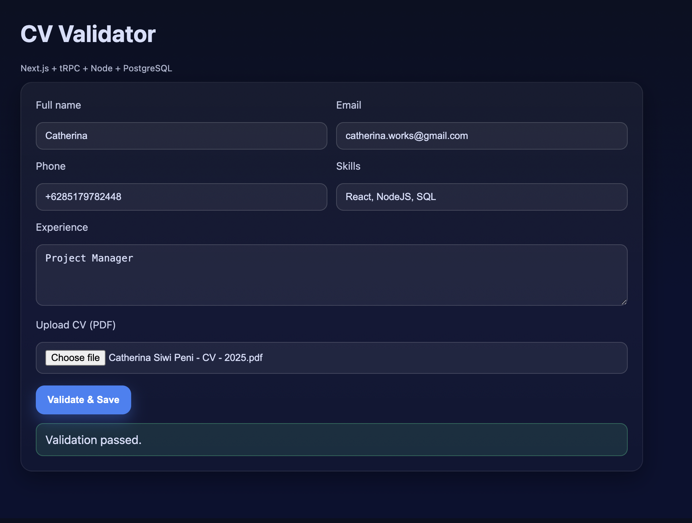
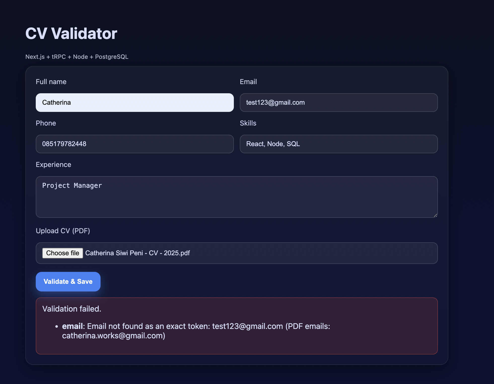
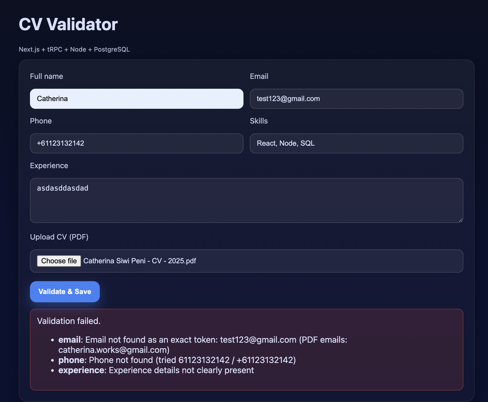
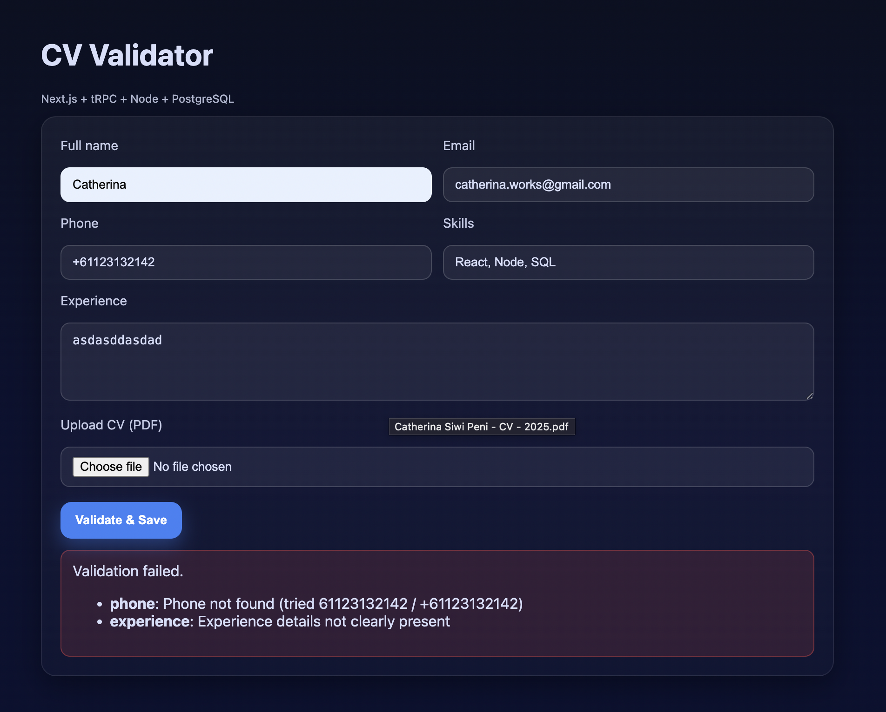
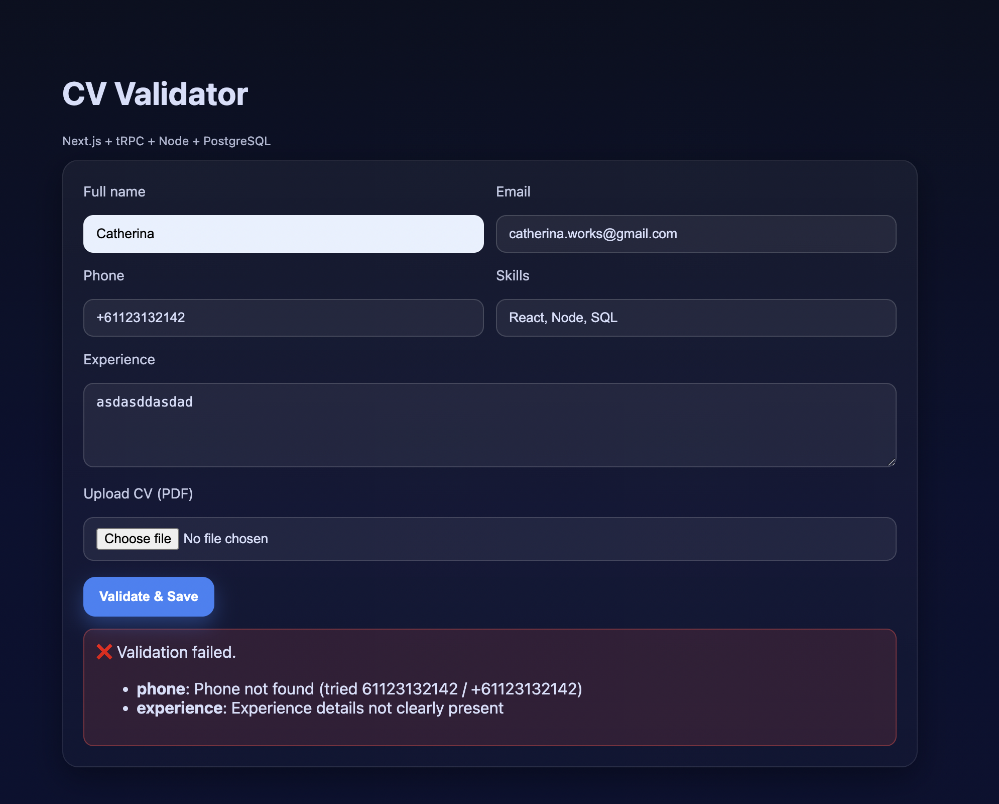
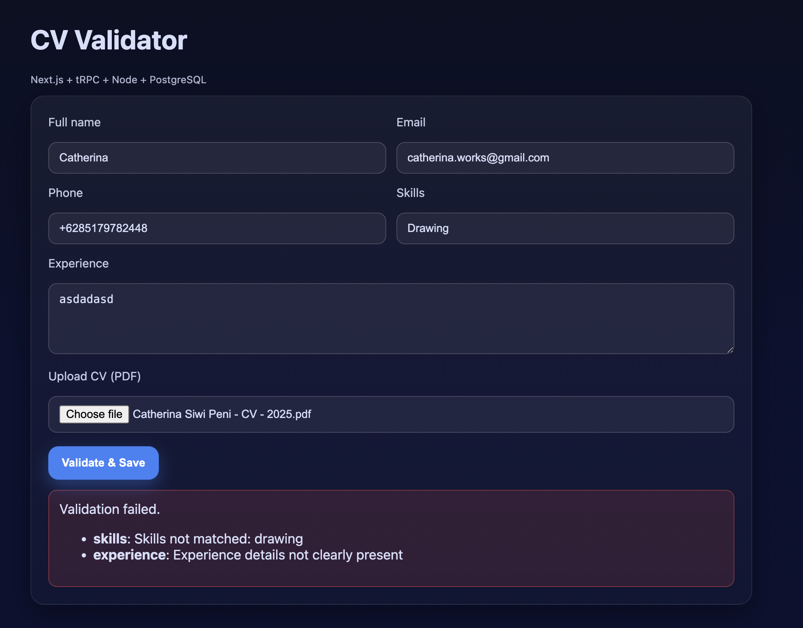

# CV Validator (Next.js + tRPC + Node.js + PostgreSQL + n8n + Docker)

A production-ready full-stack CV validation app that:

- Lets a user enter profile/CV fields (name, email, phone, skills, experience)
- Uploads a CV PDF
- Validates entered data vs the PDF using an external AI/n8n webhook with `AI_WEBHOOK_URL`
- Saves validated CV data into PostgreSQL

## Test Results

Below are the screenshots from the validation test results:

**Passed Test**


**Error Tests**






---

## Architecture Highlights

- **Frontend**: Next.js (App Router) + tRPC client
- **Backend**: Node.js (Express) + tRPC server, file uploads (multer), Prisma ORM (PostgreSQL)
- **Database**: PostgreSQL
- **Validation**: Pluggable AI via `AI_WEBHOOK_URL` or local PDF parsing
- **Automation**: Optional n8n webhook workflow for smarter/fuzzy validation
- **Deployment**: Docker Compose for production-ready multi-service setup

---

## Quick Start (Docker)

**Prerequisites**:
- Docker & Docker Compose (`docker compose` on modern Docker Desktop)
- `.env` file in project root

**Steps**:
```bash
# 1. Copy env example
cp .env.example .env

# 2. Build & run
docker compose up -d --build

# 3. Apply Prisma migrations
docker compose exec backend npx prisma migrate deploy

# 4. Visit
# Frontend: http://localhost:3000
# Backend health: http://localhost:4000/health
```

**Logs**:
```bash
docker compose logs -f backend
```

**Stop**:
```bash
docker compose down
```

---

## Local Development (No Docker)

**Prerequisites**:
- Node.js 20+
- pnpm or npm
- PostgreSQL running locally

```bash
# Backend
cd backend
npm install
npx prisma migrate dev --name init
npm run dev

# Frontend (in another terminal)
cd ../frontend
npm install
npm run dev
```

Frontend expects `BACKEND_URL` to be `http://localhost:4000` in `.env` for development.

---

## Environment Variables

Example `.env`:
```
# Shared
NODE_ENV=production

# Backend
DATABASE_URL=postgresql://postgres:postgres@db:5432/appdb?schema=public
PORT=4000
UPLOAD_DIR=/app/uploads
AI_WEBHOOK_URL=

# Frontend
BACKEND_URL=http://backend:4000
NEXT_PUBLIC_BACKEND_URL=http://localhost:4000  # for local dev
```

---

## tRPC API

**Mutation**: `cv.validateAndSave`
- **Input**: `{ fullName, email, phone, skills, experience, fileToken }`
- **Output**:
  - Success: `{ ok: true, id }`
  - Failure: `{ ok: false, errors: { field: reason } }`

File uploads use REST: `POST /upload` with `multipart/form-data` (`file` field). Returns `{ fileToken }`.

---

## Repository Layout
```
backend/
  Dockerfile
  prisma/schema.prisma
  src/
frontend/
  Dockerfile
docker-compose.yml
.env.example
```