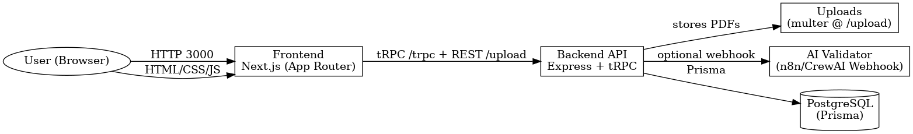

# CV Validator (Next.js + tRPC + Node + PostgreSQL + Docker)

A small full‑stack app that:
- Lets a user enter profile/CV fields (name, email, phone, skills, experience)
- Uploads a CV PDF
- Validates entered data vs the PDF using either:
  - An external AI/n8n webhook (if provided), or
  - A built-in local validator (naive string matching)

Architecture highlights:
- **Frontend**: Next.js (App Router) + tRPC client
- **Backend**: Node.js (Express) + tRPC server, file uploads (multer), Prisma (PostgreSQL)
- **DB**: PostgreSQL
- **Validation**: pluggable AI via `AI_WEBHOOK_URL` (e.g., n8n), or fallback local PDF parsing
- **Deployment**: `docker-compose` brings up everything for production builds

---

## Quick Start (Docker)

**Prereqs**: Docker & docker-compose

1. Copy `.env.example` to `.env` and update values if needed.
2. Build & run:
   ```bash
   docker-compose up -d --build
   ```
3. Apply Prisma migration (run once after containers are healthy):
   ```bash
   docker-compose exec backend npx prisma migrate deploy
   ```
4. Visit the app:
   - Frontend: http://localhost:3000
   - Backend health: http://localhost:4000/health

To view backend logs:
```bash
docker-compose logs -f backend
```

To stop:
```bash
docker-compose down
```

---

## Local Dev (without Docker)

**Prereqs**: Node 20+, pnpm (or npm), PostgreSQL

1. Create a `.env` at the repo root from `.env.example` and set your DB URL.
2. Install deps and generate Prisma client:
   ```bash
   cd backend
   pnpm install
   npx prisma migrate dev --name init
   pnpm dev
   ```
   In another terminal:
   ```bash
   cd ../frontend
   pnpm install
   pnpm dev
   ```
3. App URLs:
   - Frontend: http://localhost:3000
   - Backend: http://localhost:4000

> The frontend expects `BACKEND_URL` to be `http://localhost:4000` in dev.

---

## Environment Variables

Create a `.env` (root). Example:
```
# Shared
NODE_ENV=production

# Backend
DATABASE_URL=postgresql://postgres:postgres@db:5432/appdb?schema=public
PORT=4000
UPLOAD_DIR=/app/uploads
AI_WEBHOOK_URL=        # optional: if set, backend will POST JSON payload to this URL for AI validation

# Frontend
BACKEND_URL=http://backend:4000
NEXT_PUBLIC_BACKEND_URL=http://localhost:4000  # used only when serving directly
```

Notes:
- If `AI_WEBHOOK_URL` is set, backend sends `{ fields, pdfText }` to that URL.
  The service should reply JSON: `{ ok: boolean, errors?: Record<string,string> }`.
- If not set, backend performs naive local validation by checking whether provided fields are substrings of the PDF text.

---

## tRPC API

- `cv.validateAndSave` (mutation): Validates the input vs the uploaded PDF and persists on success.
  - **Input**: `{ fullName, email, phone, skills, experience, fileToken }`
  - **Output**:
    - Success: `{ ok: true, id }`
    - Failure: `{ ok: false, errors: { field: "reason", ... } }`

File uploads use REST: `POST /upload` with `multipart/form-data` (field: `file`). Returns `{ fileToken }` which is then passed to the tRPC mutation.

---

## Possible Challenges

- **PDF parsing variability**: Extracted text may lose formatting; robust matching may require embeddings or structured parsing.
- **False positives/negatives**: Naive contains‑checks are brittle; AI/n8n flow can implement fuzzy/semantic matching.
- **File security**: Consider virus scanning, size limits, and signed URLs in production.
- **Schema evolution**: Using Prisma for migrations; remember to `migrate deploy` on new releases.
- **Scaling**: For larger files and traffic, move uploads to object storage (S3/GCS) and serve via CDN.

---

## Bonus: Deploying on Coolify (or similar)

- Build images with the included Dockerfiles.
- Provision a Postgres database.
- Configure environment variables in Coolify.
- Point your domain to the frontend container (or a reverse proxy) and set `BACKEND_URL` accordingly.

---

## Repository Layout

```
backend/
  Dockerfile
  prisma/schema.prisma
  src/
    index.ts
    trpc.ts
    routers/
      index.ts
      cv.ts
    ai/validate.ts
    upload.ts
    db.ts
  package.json
  tsconfig.json
frontend/
  Dockerfile
  next.config.js
  package.json
  tsconfig.json
  src/app/page.tsx
  src/app/globals.css
  src/lib/trpc.ts
  src/utils/trpcClient.ts
  src/types/index.ts
docker-compose.yml
.env.example
```

---

## License

MIT


## Architecture Diagram



---

## Publish to GitHub

1. Create a new empty repo on GitHub (e.g., `cv-validator`), **without** any README/license.
2. Locally:
   ```bash
   git init
   git add .
   git commit -m "feat: initial commit (Next.js + tRPC + Prisma + Docker)"
   git branch -M main
   git remote add origin git@github.com:<your-username>/cv-validator.git
   git push -u origin main
   ```
3. In GitHub, add a **Repository description**, then paste the **Quick Start (Docker)** into the README if you like.
4. (Optional) Add a CI check (Node 20) with GitHub Actions.
